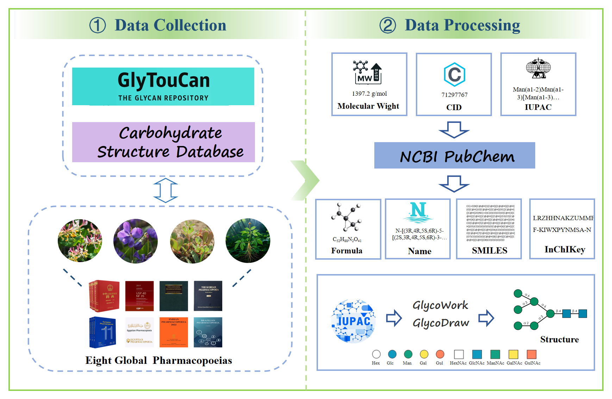

# HerbalCDB
Herbal Carbohydrate Database 
# GlycoDraw Tool Integration

## Data Source

- [ CSDB ](http://csdb.glycoscience.ru/database/)
- [ Glytoucan ](https://glytoucan.org)

## Tool Source
The `GlycoDraw` tool utilized in this project is sourced from the `glycowork` library. For more details, refer to the following publications:

- [Glycowork Publication 1](https://academic.oup.com/glycob/article/31/10/1240/6311240?login=false)
- [Glycowork Publication 2](https://academic.oup.com/glycob/article/33/11/927/7232175)

## Installation
- To install the `glycowork` library with drawing capabilities, run the following command:

```shell
pip install "glycowork[draw]"
```
## Usage
- To use GlycoDraw for generating glycan structure diagrams:
```
from glycowork.motif.draw import *

# Example usage
GlycoDraw("Mana1-6(Mana1-3)Manb1-4GlcNAcb1-4GlcNAcb")
```
## Handling Unclosed Parentheses in IUPAC Strings

- If your IUPAC string has unclosed parentheses, you can use the following function to clean it up:
```
def remove_unclosed_parentheses_and_suffix(s):
    open_count = 0
    result = []
    for char in s:
        if char == '(':
            open_count += 1
        elif char == ')':
            if open_count > 0:
                open_count -= 1
            else:
                continue
        result.append(char)
    if open_count > 0:
        temp_str = ''.join(result)
        last_open_index = temp_str.rfind('(')
        result = list(temp_str[:last_open_index])
    return ''.join(result)
```
This function helps ensure that your IUPAC strings are properly formatted before processing with  `GlycoDraw` .
## Results
- Generated result image：


